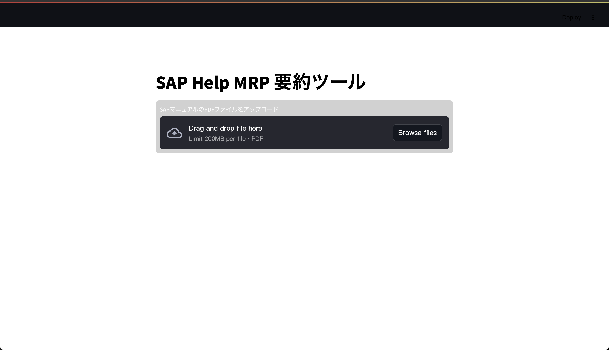
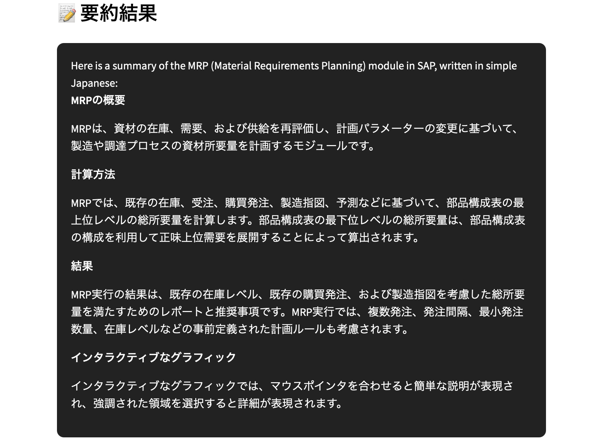
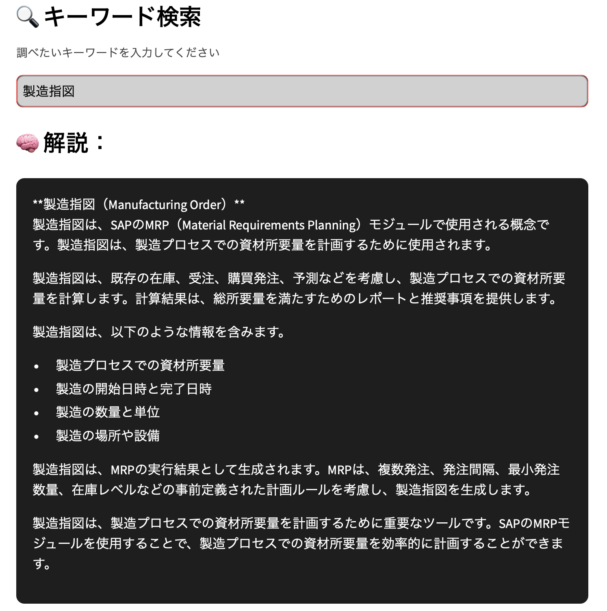

# 📝 SAP Help 要約ツール

SAP Help Portal のPDFをアップロードし、AI（Groq API）で初心者向けに要約するStreamlitアプリです。

---

## 🚀 主な機能

- 📄 PDFファイルアップロード対応
- 🤖 Llama3（Groq API）による要約生成
- 🔍 キーワード検索（要約内から検索・追加解説）
- ☁️ ワードクラウドによるキーワード可視化
- 🌗 ダーク＆ライトを組み合わせたモダンUI
- 🖋 日本語フォント対応で読みやすい表示

---

## 🛠 使用技術

| 分類     | 使用技術                          |
|----------|-----------------------------------|
| フロント | Streamlit                         |
| 分析     | pandas / WordCloud                |
| AI連携   | Groq API（llama3-8b）             |
| その他   | dotenv / matplotlib / pdfplumber  |

---

## ⚙️ 実行方法

```bash
streamlit run streamlit_app.py
```

---

## 📦 セットアップ手順

1. **Python 3.9〜3.11 をインストール**

2. **必要なライブラリをインストール**

    ```bash
    pip install -r requirements.txt
    ```

3. **`.env` ファイルを作成し、以下のように記述**

    ```
    GROQ_API_KEY=sk-xxxxxxxxxxxxxxxxxxxxxxxx
    ```

> ⚠️ `.env` ファイルは **絶対に GitHub にアップしないでください！**

---

## 🖼 画面イメージ（例）

※ `img/` フォルダに以下の画像を保存してから記述します。

```markdown




```

---

## 📄 ライセンス

このリポジトリは **MIT License** のもとで公開されています。

---

## 👤 作者

- GitHub: `u8m`